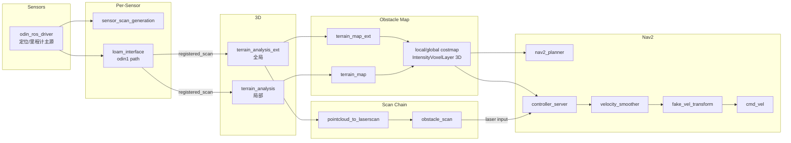

# GXU_ROBOTZ_NAV2026

GXU RobotZ 2026 赛季 ROS 2 (Humble) 导航工作空间 —— RoboMaster 哨兵机器人。

- Nav2 实车导航与建图（odin1 分支，无仿真）
- 单 LiDAR（odin1）3D 点云地形分析
- Docker 容器开发，多分支构建缓存隔离

> 导航主代码位于 `src/gxu2026_sentry_nav/`，包级说明见各子包 README。

---

## 1. 环境要求

| 项目 | 要求 |
|------|------|
| OS | Ubuntu 22.04 |
| ROS 2 | Humble |
| 构建工具 | colcon, rosdep |
| 容器 | Docker + docker compose |

---

## 2. 目录结构

```text
src/              ROS 2 packages
scripts/          启动/构建/诊断脚本
docker/           Dockerfile + compose 文件
maps/             自动保存的地图（容器生成，宿主机可见）
bags/             录包数据
launch_logs/      启动日志
.buildcache/      多分支构建缓存（按分支名隔离）
```

---

## 3. 快速开始

### 3.1 构建环境镜像（一次性）

```bash
docker compose -f docker/compose.build.yml build
```

### 3.2 启动开发容器

```bash
# 笔记本（有 GPU）
docker compose -f docker/compose.dev.yml --profile laptop up dev-laptop

# 小电脑实车（无 GPU）
docker compose -f docker/compose.dev.yml --profile robot up dev-robot
```

Container Tools UI：右键 `docker/compose.dev.yml` → Compose Up，选对应服务。

### 3.3 容器内构建

```bash
colcon build --symlink-install
```

首次构建用 `complete_build.sh`（串行，稳定），日常用 `quick_build.sh`（并行）：

```bash
./scripts/complete_build.sh
./scripts/quick_build.sh
```

---

## 4. 运行

### 导航（重定位模式）

```bash
./scripts/nav.sh
```

默认参数：`odin_map_mode:=2`（重定位），`slam:=False`。

环境变量覆盖：

| 变量 | 默认值 | 说明 |
|------|--------|------|
| `ODIN_MODE_PRESET` | 2 | odin 驱动模式（1=SLAM, 2=重定位） |
| `NAV2_TF_WARMUP_ENABLED` | False | TF 预热开关 |
| `NAV2_TF_WARMUP_TIMEOUT_SEC` | 30.0 | TF 预热超时 |

### 建图

```bash
./scripts/mapping.sh
```

默认参数：`slam:=True`，`ODIN_MODE_PRESET=1`。

### 停止

```bash
./scripts/stop_launch.sh
```

### Bag 回放

```bash
./scripts/bag_nav.sh               # 导航回放
./scripts/bag_odin1_mapping.sh     # 建图回放
```

### 其他

```bash
./scripts/rmuc_map_calib.sh        # RMUC 地图标定
./scripts/rmuc_test_publisher.py   # RMUC 测试话题发布
```

---

## 5. 架构

### 5.1 数据流



### 5.2 实车约定

| 约定 | 说明 |
|------|------|
| 定位主源 | odin1，`odom -> base_footprint` 由 odin 驱动负责 |
| Costmap | `IntensityVoxelLayer`（3D 体素层），intensity = 地面相对高度 |
| TF 防抖 | `sensor_scan_generation.publish_base_tf=false` |

### 5.3 开关（navigation_launch）

| 参数 | 作用 |
|------|------|
| `enable_scan_additive` | scan 合成链路 |
| `enable_terrain_analysis` | 地形分析（3D costmap） |

### 5.4 Odin 地图保存

- 目录：`/ws/src/odin_ros_driver/map/{driver_start_time}/`
- 文件名：`map_{save_time}.bin`（北京时间 UTC+8）

### 5.5 框架图

- `docs/architecture/planned_pipeline.drawio`

---

## 6. Docker

### 开发容器挂载

| 容器路径 | 来源 | 说明 |
|----------|------|------|
| `/ws/src` | 宿主机 `src/` | 改代码直接生效 |
| `/ws/scripts` | 宿主机 `scripts/` | 脚本同步 |
| `/ws/build` | bind mount | 宿主机可直接清除 |
| `/ws/install` | bind mount | 编译产物 |
| `/ws/maps` | 宿主机 `maps/` | 地图持久化 |
| `/ws/bags` | 宿主机 `bags/` | 录包数据 |

### 多分支构建缓存

容器入口脚本自动检测当前 git 分支，从 `.buildcache/<分支名>/install/setup.bash` source 编译产物。不同分支环境和构建产物完全隔离。

### 依赖变更

| 变更类型 | 操作 |
|----------|------|
| 改业务代码 | 容器内 `colcon build` |
| 改 package.xml | 重建镜像 |
| 改 requirements.txt | 重建镜像 |

---

## 7. 参考

- 导航主包：`src/gxu2026_sentry_nav/`
- 框架图：`docs/architecture/planned_pipeline.drawio`
