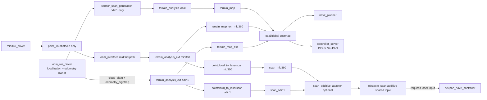

# GXU_ROBOTZ_NAV2026

GXU RobotZ 2026 赛季 ROS 2（Humble）导航工作空间。

- 基于 Nav2 的仿真/实车导航与建图流程
- 集成 NeuPAN（`neupan_nav2_controller`）控制器插件：**必须在虚拟环境中构建与运行**（见下文）
- 主要启动/构建入口集中在 `./scripts/`

> 说明：本工作空间导航主代码位于 `src/gxu2026_sentry_nav/`，本 README 仅保留高频入口与当前分支约定。
> 更细的包级说明可按需查看各子包 README。

---

## 1. 环境要求

- OS：Ubuntu 22.04（建议）
- ROS 2：Humble
- 构建工具：`colcon`, `rosdep`
- 图形终端：脚本默认优先使用 `gnome-terminal`，否则使用 `x-terminal-emulator`

> 备注：多个脚本会导出 NVIDIA PRIME 相关环境变量（`__NV_PRIME_RENDER_OFFLOAD` 等）。如果你不是双显卡/PRIME 环境，一般不影响功能；必要时可自行取消。

---

## 2. 目录结构（约定）

- `src/`：ROS 2 packages（导航/仿真/驱动/控制器等）
- `scripts/`：一键脚本（建环境、构建、仿真、实车启动）
- `neupan_env/`：NeuPAN Python 虚拟环境（**必须**，并且目录内带 `COLCON_IGNORE` 防止被 colcon 当成包）
- `build/ install/ log/`：colcon 生成目录

---

## 3. 快速开始（推荐路径）

### 3.1 安装依赖（一次性）

在工作空间根目录执行：

```bash
rosdep install -r --from-paths src --ignore-src --rosdistro $ROS_DISTRO -y
```

> 如果你是首次使用 rosdep，请先完成 rosdep 初始化（此处不赘述）。

### 3.2 初始化 NeuPAN 虚拟环境（一次性或依赖变更后）

**neupan 相关一定要在虚拟环境构建**：

```bash
./scripts/setup_neupan_env.sh
```

常用可选参数（按需）：

- 重新创建 venv：

```bash
RECREATE_VENV=1 ./scripts/setup_neupan_env.sh
```

- 指定 python：

```bash
PYTHON_BIN=python3 ./scripts/setup_neupan_env.sh
```

该脚本会：
- 创建/更新 `./neupan_env`
- 安装 `src/gxu2026_sentry_nav/neupan_nav2_controller/requirements.txt` 中的依赖（包含 CPU 版 PyTorch 索引）
- 处理 ECOS 的兼容性补丁（脚本内置 best-effort patch）

### 3.3 构建（每次代码更新后）

推荐使用脚本构建，它会先构建非 NeuPAN 包，再激活虚拟环境构建 `neupan_nav2_controller`：

- 稳定构建（串行，资源占用更低）：

```bash
./scripts/complete_build.sh
```

- 快速构建（并行，机器性能好可用）：

```bash
./scripts/quick_build.sh
```

---

## 4. 运行

> 运行前提：已经成功构建并生成 `install/setup.bash`。

### 4.1 仿真：导航

```bash
./scripts/nav_sim.sh
```

该脚本会启动 Gazebo 与 Nav2；如果你的参数文件中选择了 NeuPAN 控制器插件，会自动激活 `neupan_env`（见 5.1）。

### 4.2 仿真：建图（SLAM）

```bash
./scripts/sim_mapping.sh
```

### 4.3 实车：导航（非 SLAM）

```bash
./scripts/start_navigation.sh
```

### 4.3.1 实车：重定位导航（Nav2 侧开启 SLAM Toolbox 建图）

```bash
./scripts/start_navigation_relocalization.sh
```

说明：该入口默认使用 `odin_map_mode:=2` 并设置 `slam:=True`，用于 Odin1 重定位场景下由 Nav2 侧同时进行建图。

### 4.4 实车：建图（SLAM）

```bash
./scripts/mapping.sh
```

### 4.4.1 远端一键启动（SSH）+ 本机弹出 RViz（DDS 触发）

场景：你通过 VS Code SSH 连接小电脑（无 GUI），希望在远端只跑建图/导航并记录日志，但在本机自动弹出 `rviz2`。

1) 在本机（有 GUI 的电脑）先启动 RViz 触发服务（建议开一个终端常驻）：

```bash
cd <你的 ros2_ws>
source /opt/ros/humble/setup.bash
source install/setup.bash

# 可选：本机用 NVIDIA 渲染（默认已启用；设为 0 关闭）
export RVIZ_NVIDIA=1

# 可选：UI/字体缩放（Qt）
export RVIZ_QT_SCALE=1.2

python3 scripts/rviz_daemon.py
```

2) 在小电脑（VS Code SSH 终端）执行一键脚本：

- 实车建图：

```bash
ROS_DOMAIN_ID=66 ROS_LOCALHOST_ONLY=0 ./scripts/reality_mapping_oneclick.sh
```

- 实车导航：

```bash
ROS_DOMAIN_ID=66 ROS_LOCALHOST_ONLY=0 ./scripts/reality_navigation_oneclick.sh
```

说明：两端需保持一致的 `ROS_DOMAIN_ID`（以及如有需要的 `RMW_IMPLEMENTATION`），并确保 `ROS_LOCALHOST_ONLY=0`。

### 4.5 其他常用脚本

- 启动串口驱动：

```bash
./scripts/serial_driver.sh
```

- 诊断 map->odom TF 发布源（自动生成时间戳日志）：

```bash
./scripts/verify_map_odom_tf.sh
```

日志输出到：`launch_logs/<branch>/verify_map_odom_tf_YYYYMMDD_HHMMSS.log`

- 发布决策/比赛相关话题（调试用）：

```bash
./scripts/publish_script.sh
```

### 4.6 实车数据录包（ros2 bag）

当前阶段建议：**实车每次运行都录包**，用于复现与回放验证算法。

- 实车 wrapper 启动时是否自动录包，由
  `config/reality/nav2_params.yaml` 中
  `robot_description_runtime.ros__parameters.bag_record.enabled` 控制。
- 如需手动录包，直接使用：

```bash
ros2 run ros2_bag_tools record_bag
```

- 回放：

```bash
ros2 run ros2_bag_tools play_bag ./src/ros2_bag_tools/bags/<时间目录>
```

如需估算录包大小，最直接的方法是录一次然后查看目录大小（`du -sh <bag_dir>`）。
更多说明见：`src/ros2_bag_tools/README.md`

---

## 5. 配置与开关

### 5.1 NeuPAN 虚拟环境是否会被自动启用？

脚本会读取参数文件中的：

- `pb_navigation_switches.ros__parameters.controller_plugin`

当该字段为以下值时，脚本会自动 `source neupan_env/bin/activate` 并把 venv site-packages 加到 `PYTHONPATH`：

- `neupan_nav2_controller`
- （部分脚本也支持）`neupan_slam_controller`

对应默认参数文件路径：

- 仿真：`src/gxu2026_sentry_nav/gxu2026_nav_bringup/config/simulation/nav2_params.yaml`
- 实车：`src/gxu2026_sentry_nav/gxu2026_nav_bringup/config/reality/nav2_params.yaml`

### 5.2 NeuPAN 模型加载（如果需要）

- 实车脚本默认尝试加载：

`install/neupan_models/share/neupan_models/local_setup.bash`

若该文件不存在，会给出 warning 并跳过。

- 仿真脚本默认不设置模型 hook（`NEUPAN_MODEL_SETUP` 为空）。若你需要外部模型包，可在运行前指定：

```bash
NEUPAN_MODEL_SETUP=/path/to/local_setup.bash ./scripts/nav_sim.sh
```

### 5.3 当前实车链路约定（2026-04 更新）

以下为当前已落地并默认启用的 reality 侧约定：

- 定位/里程计主源：`odin1`
  - `pb_navigation_switches.odometry_source=odin1`
  - `odom -> base_footprint` 由 odin 驱动链路负责

- TF 防抖：避免重复发布 `odom -> base_footprint`
  - `sensor_scan_generation.publish_base_tf=false`

- mid360 角色：点云补盲（不接管定位）
  - `point_lio` 使用 obstacle-only 配置：
    `src/gxu2026_sentry_nav/gxu2026_nav_bringup/config/reality/point_lio_obstacle_only.yaml`
  - 该配置默认关闭 `tf_send_en` 和 `path_en`，仅保留补盲所需点云输出

- 规划/控制输入：local/global costmap 双源观测
  - local costmap: `terrain_map` + `terrain_map_ext_mid360`
  - global costmap: `terrain_map_ext` + `terrain_map_ext_mid360`
  - 因此 PID 控制链路主要通过 costmap 间接受益于 mid360 补盲

- `obstacle_scan` 使用边界
  - `obstacle_scan_additive` 是共享话题，不是仅供某一控制器私有
  - NeuPAN 必需使用该类激光输入（`laser_topic=/obstacle_scan`）
  - PID 场景通常不直接依赖 `obstacle_scan`，主要依赖 costmap

- 开关关系（navigation_launch）
  - `enable_mid360_costmap_additive`：控制 mid360->costmap 补盲链路
  - `enable_scan_additive`：控制 scan 合成链路（`scan_odin1 + scan_mid360 -> obstacle_scan`）

### 5.4 Odin 地图保存路径与时间戳

- 默认建图结果目录（`mapping_result_dest_dir` 留空时）：
  - `/ws/src/odin_ros_driver/map/{driver_start_time}/`

- 默认文件名（`mapping_result_file_name` 留空时）：
  - `map_{save_time}.bin`

- `driver_start_time` 与 `save_time` 使用北京时间（UTC+8）生成。

### 5.5 当前分支框架图

- Draw.io 源文件：`docs/architecture/planned_pipeline.drawio`



说明：
- odin1 负责定位和里程计，不与 mid360 做位姿融合。
- mid360 主要用于点云补盲，默认服务 costmap；scan additive 作为共享输出按需启用。

---

## 6. 常见问题（FAQ）

1) **提示 NeuPAN venv 不存在**（`NeuPAN virtualenv not found .../neupan_env/bin/activate`）

- 先执行：`./scripts/setup_neupan_env.sh`

2) **没有可用的图形终端**（脚本报 `No supported graphical terminal available.`）

- 安装 `gnome-terminal`，或设置 `TERMINAL_CMD` 指向你系统可用的终端程序。

3) **运行时 Python 依赖/ABI 报错**

- NeuPAN 依赖在 `src/gxu2026_sentry_nav/neupan_nav2_controller/requirements.txt` 中对 `numpy<2`、`scipy<1.15` 有约束。
- 优先使用 `./scripts/setup_neupan_env.sh` 统一安装，不建议混用系统 pip。

---

## 7. 参考

- 当前导航主包（含 launch、参数、行为树等）：
  - `src/gxu2026_sentry_nav/gxu2026_nav_bringup/`
- 框架图：
  - `docs/architecture/planned_pipeline.drawio`

---

## 8. Docker 镜像（部署到小电脑）

本工作空间根目录提供了多阶段 [Dockerfile](Dockerfile)：构建阶段会先 `colcon build`（跳过 `neupan_nav2_controller`），再创建/安装 NeuPAN Python 依赖虚拟环境，最后在 venv 下编译 `neupan_nav2_controller`。

### 8.1 构建镜像

首次构建或 **任何 `package.xml` 变更后**，先生成 rosdep 依赖快照（减少重复跑 `rosdep install` 的时间）：

```bash
./scripts/gen_rosdep_src.sh
```

```bash
docker build -t gxu_robotz_nav2026:latest .
```

可选参数（按需）：

```bash
DOCKER_BUILDKIT=1 docker build --progress=plain --network host -t gxu_robotz_nav2026:latest \
--build-arg APT_MIRROR=mirrors.tuna.tsinghua.edu.cn \
--build-arg http_proxy=http://127.0.0.1:7897 --build-arg https_proxy=http://127.0.0.1:7897 \
--build-arg HTTP_PROXY=http://127.0.0.1:7897 --build-arg HTTPS_PROXY=http://127.0.0.1:7897 \
. 2>&1 | tee docker_build_plain.log

```

> 注意：`COLCON_SKIP_PACKAGES` 需要是“空格分隔”的包名列表。若你要裁剪仿真相关包以减小镜像体积，请先告诉我你要保留/裁剪的包，我再帮你给出一份默认推荐列表（避免瞎猜）。

### 8.1.1（推荐）带版本号构建 + 同步 latest + 推送 Docker Hub

说明：
- `latest` 始终指向“最新可用镜像”
- 同时打一个日期版本号 tag（便于回滚/对齐小电脑部署）

```bash
# 你的 Docker Hub 命名空间（用户名或组织名）
export DOCKERHUB_NS=alphabet2006
# 仓库名
export IMAGE_REPO=gxu_robotz_nav2026
# 版本号（示例：v20251228_2359）
export IMAGE_TAG="v$(date +%Y%m%d_%H%M)"

DOCKER_BUILDKIT=1 docker build --progress=plain --network host \
  -t ${IMAGE_REPO}:latest \
  -t ${DOCKERHUB_NS}/${IMAGE_REPO}:${IMAGE_TAG} \
  -t ${DOCKERHUB_NS}/${IMAGE_REPO}:latest \
  --build-arg APT_MIRROR=mirrors.tuna.tsinghua.edu.cn \
  --build-arg http_proxy=http://127.0.0.1:7897 --build-arg https_proxy=http://127.0.0.1:7897 \
  --build-arg HTTP_PROXY=http://127.0.0.1:7897 --build-arg HTTPS_PROXY=http://127.0.0.1:7897 \
  . 2>&1 | tee docker_build_plain.log

docker login -u ${DOCKERHUB_NS}
docker push ${DOCKERHUB_NS}/${IMAGE_REPO}:${IMAGE_TAG}
docker push ${DOCKERHUB_NS}/${IMAGE_REPO}:latest
```

### 8.2 运行镜像

容器默认进入 bash，并已自动 source：`/opt/ros/$ROS_DISTRO/setup.bash` 与 `/ws/install/setup.bash`。

#### 8.2.1（有桌面/需要 RViz）自动授权容器访问宿主机 X11（推荐）

首次配置一次即可，后续每次图形化登录会自动生效：

```bash
systemctl --user daemon-reload
systemctl --user enable --now docker-x11-access.service
```

可选检查：

```bash
systemctl --user --no-pager status docker-x11-access.service
```

如果该服务尚未安装，请先按 9.2.3 创建脚本与 service。

#### 8.2.2 创建并进入容器

说明：
- 使用 `--network host` 便于 ROS 2 发现与多机通信
- 映射 X11 用于 RViz
- 映射 `/dev` 便于后续访问雷达/串口等设备（按需）

```bash
docker run -it --rm --name gxu_robotz_nav2026 \
  --network host \
  -e "DISPLAY=$DISPLAY" \
  -v /tmp/.X11-unix:/tmp/.X11-unix \
  -v /dev:/dev \
  alphabet2006/gxu_robotz_nav2026:latest
```

#### 8.2.3（无桌面小电脑）最小运行

```bash
docker run -it --rm --name gxu_robotz_nav2026 \
  --network host \
  -v /dev:/dev \
  alphabet2006/gxu_robotz_nav2026:latest
```

> 说明：仓库里的 `scripts/*` 多数会尝试调用图形终端（`gnome-terminal`/`x-terminal-emulator`）打开新窗口；在无桌面/无 X11 的小电脑上更建议直接在容器内运行 `ros2 launch ...`。

---

## 9. Docker 开发环境（`Dockerfile.env` + 挂载代码）

与 Section 8 不同，本节的镜像 **只打包依赖，不编译代码**。
开发时把 `src/` 挂载进容器，在容器内 `colcon build`，改代码后无需重建镜像。

### 9.1 镜像内包含的依赖

| 类别 | 具体内容 |
|---|---|
| **基础镜像** | `ros:humble-ros-base`（Ubuntu 22.04 + ROS2 Humble） |
| **编译工具** | `build-essential` / `cmake` / `git` / `curl` / `wget` |
| **Python 工具链** | `python3-pip` / `python3-venv` / `python3-dev` / `python3-colcon-common-extensions` / `python3-rosdep` |
| **点云 / 线性代数** | `libpcl-dev` / `libeigen3-dev` / `libomp-dev` |
| **OpenGL / EGL 渲染** | `libgl1-mesa-dev` / `libgles2-mesa-dev` / `libegl1-mesa-dev` / `mesa-utils` / `xvfb` |
| **仿真（Ignition Fortress）** | `ros-humble-ros-gz-sim` / `ros-humble-ros-gz-bridge` / `ignition-fortress`（通过 OSRF apt 源 + rosdep） |
| **ROS 包依赖** | 由 `docker/rosdep_src/` 下的 `package.xml` 快照 `rosdep install` 安装（含导航、感知、描述等全部包依赖） |
| **small_gicp** | 预编译并 `cmake --install` 到系统（重定位 / 点云配准用） |
| **NeuPAN Python venv** | `numpy<2` / `scipy<1.15` / `torch==2.1.0+cpu` / `cvxpy` / `cvxpylayers` / `diffcp` / `ecos` / `gctl` / `clarabel` / `osqp` / `scs` / `matplotlib` / `scikit-learn` |
| **NVIDIA GPU 透传** | `NVIDIA_VISIBLE_DEVICES=all` + `NVIDIA_DRIVER_CAPABILITIES=graphics,compute,display,utility`，配合 nvidia-container-toolkit 透传宿主机 GPU（Gazebo 渲染 + CUDA） |

> **不包含**：CUDA/cuDNN 运行时（torch 为 CPU 版）、TensorRT。如需 CUDA 推理需替换 base 镜像。

### 9.2 宿主机前置条件（一次性）

```bash
# 1. 安装 nvidia-container-toolkit（已完成则跳过）
sudo apt-get install -y nvidia-container-toolkit
sudo nvidia-ctk runtime configure --runtime=docker
sudo systemctl restart docker
```

#### 步骤 2：配置 X11 自动授权（系统服务，支持 Wayland + NoMachine）

> **为什么需要这步**：
> 1) `/tmp` 每次重启会清空，`/tmp/.docker.xauth` 会丢失。  
> 2) Wayland 和 NoMachine 的授权 cookie 位置不固定，单纯绑定 `~/.Xauthority` 经常不够用。  
> 3) 旧方案是 user service + 单一 `DISPLAY=:0`，容易在 Wayland / NoMachine / 连屏幕切换后失效。
>
> 新方案使用 **system service + timer**，周期性汇总 `/home/*/.Xauthority`、`/run/user/*/Xauthority`、`/run/user/*/.mutter-Xwaylandauth.*`，自动生成：
> - `/tmp/.docker.xauth`
> - `/tmp/gxu2026-docker-gui/xauth`
> - `/tmp/gxu2026-docker-gui/display`
> - `/tmp/gxu2026-docker-gui/displays`
>
> 容器启动时会优先读取这些提示文件并自动选择可用显示号，不再强依赖你启动 `docker compose` 时所在终端的 `DISPLAY`。

```bash
cd ~/ros2_ws
sudo apt-get install -y xauth
chmod +x scripts/systemd/install_docker_xauth_service.sh
sudo bash scripts/systemd/install_docker_xauth_service.sh
```

验证：

```bash
systemctl status gxu2026-docker-xauth.service
systemctl status gxu2026-docker-xauth.timer
ls -la /tmp/.docker.xauth   # 应为普通文件，非目录
xauth -f /tmp/.docker.xauth list | head
ls -la /tmp/gxu2026-docker-gui
cat /tmp/gxu2026-docker-gui/display
cat /tmp/gxu2026-docker-gui/displays
```

如果你有自定义路径，也可在 `docker/.env` 中设置：

```bash
DOCKER_GUI_HOST_DIR=/tmp/gxu2026-docker-gui
XAUTH_HOST_FILE=/tmp/.docker.xauth
```

> 现在即使用 VS Code 右键 `Compose Up`，容器也会在启动时自动选择一个存在 X socket 的显示号。若你想强制固定某个显示号，可在 `docker/.env` 或 compose 环境变量中额外设置 `GXU_DISPLAY_OVERRIDE=:1001`。

#### 步骤 3：配置 GDM3 登录后等待 GUI 就绪再重启开发容器

如果你希望 GDM3 登录后自动重启开发容器，并确保重启发生在 Wayland/Xwayland 的显示号和 cookie 都真正准备好之后，再安装下面这个 system service：

```bash
sudo bash scripts/systemd/install_docker_restart_service.sh
```

这个服务不再靠固定延时猜时序，而是由 `gxu2026-docker-xauth.service` 在每次同步完 GUI 授权后触发；只有当 `/tmp/gxu2026-docker-gui/ready` 和 `session_fingerprint` 成功生成，且这是本次开机/会话的新签名时，才会真正执行一次 `docker restart`。

验证：

```bash
systemctl status gxu2026-docker-restart.service
cat /tmp/gxu2026-docker-gui/status
cat /tmp/gxu2026-docker-gui/ready
cat /tmp/gxu2026-docker-gui/session_fingerprint
```

### 7.3 构建环境镜像

```bash
# 国内加速（默认已设为清华源，直接 build 即可）
docker compose -f docker/compose.build.yml build

# 带代理
http_proxy=http://127.0.0.1:7897 https_proxy=http://127.0.0.1:7897 \
  docker compose -f docker/compose.build.yml build

# 打版本号
IMAGE_TAG=$(date +%Y%m%d) docker compose -f docker/compose.build.yml build

# 构建完直接推送 Docker Hub
IMAGE_TAG=$(date +%Y%m%d) docker compose -f docker/compose.build.yml build
IMAGE_TAG=$(date +%Y%m%d) docker compose -f docker/compose.build.yml push
```

> 依赖没变就不需要重建镜像，一次构建长期复用。

### 9.4 启动开发容器

```bash
# 笔记本（有 NVIDIA GPU，跑仿真）
docker compose -f docker/compose.dev.yml --profile laptop up dev-laptop

# 小电脑实车（无 GPU）
docker compose -f docker/compose.dev.yml --profile robot up dev-robot

# 指定镜像 tag
IMAGE_TAG=20260228 docker compose -f docker/compose.dev.yml --profile laptop up dev-laptop
```

> Container Tools UI：右键 `docker/compose.dev.yml` → "Compose Up (Select Services)"，选对应服务即可。

| 路径 | 来源 | 说明 |
|---|---|---|
| `/ws/src` | 宿主机 `src/` | 改代码直接生效，容器内 build |
| `/ws/scripts` | 宿主机 `scripts/` | 启动脚本同步 |
| `/ws/build` | Docker 命名 volume | 持久化，重启不丢编译缓存 |
| `/ws/install` | Docker 命名 volume | 持久化 |
| `/ws/log` | Docker 命名 volume | 持久化 |
| `/ws/neupan_env` | 镜像内 | 已预置，不被 src/ 覆盖 |

### 9.5 容器内常用命令

```bash
# 首次编译（或有新包时）
colcon build --symlink-install

# 仅编译指定包
colcon build --symlink-install --packages-select gxu2026_nav_bringup

# source 编译结果
source install/setup.bash

# 验证 GPU
nvidia-smi

# 启动仿真（Ignition Fortress）
ros2 launch rmu_gazebo_simulator ...

# NeuPAN 控制器运行（venv 已预置，直接激活）
source /ws/neupan_env/bin/activate
ros2 launch ...
```

### 9.6 依赖变更时的处理

| 变更类型 | 需要重建镜像？ | 操作 |
|---|---|---|
| 改业务代码（`src/`） | ❌ | 容器内 `colcon build` 即可 |
| 新增/修改 `package.xml` 里的 apt 依赖 | ✅ | 更新 `docker/rosdep_src/` 后重建 |
| 修改 `neupan_nav2_controller/requirements.txt` | ✅ | 重建镜像 |
| `small_gicp` CMakeLists 变动 | ✅ | 重建镜像 |
