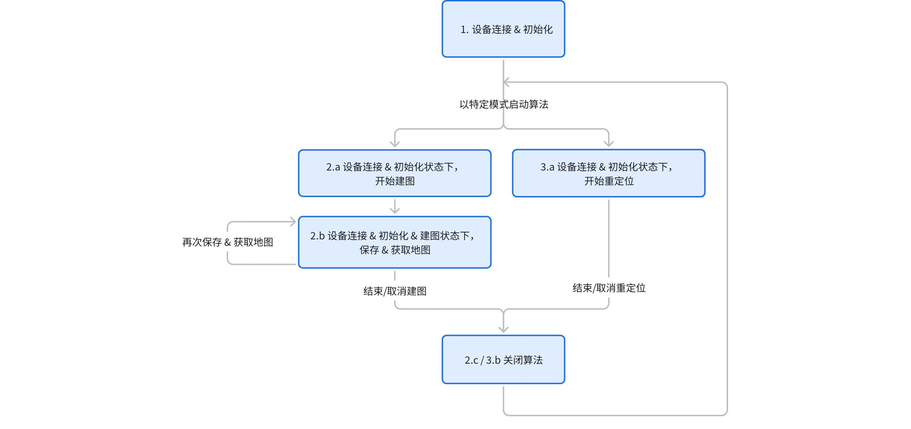

6. 建图与重定位建议调用流程
6.1 文档说明
本文档介绍典型场景下建议的建图 & 重定位功能调用流程。

6.2 概念说明
设备：Odin1 设备
主机：连接 Odin1 并运行上位机调用 API 的设备
设备运行模式：Odin1 提供【算法】和【传感器】两种主要运行模式
传感器运行模式：设备仅上传所有传感器原始数据
算法运行模式：Odin1 设备内部算法的运行模式，分别是里程计模式、SLAM 模式、和重定位模式
地图文件：Odin1 内部算法在 SLAM 模式下生成的特殊格式地图文件
6.3 整体流程
建议将设备初始化开流后保持与设备连接，通过特定 API 对设备工作模式（raw / slam）、算法工作模式（odom / 建图 / 重定位）、以及特定数据流的开关进行控制，确保设备响应速度，避免与设备反复重连及设备内部反复重新初始化。

6.4 具体流程
6.4.1 设备连接 & 初始化
// 初始化 sdk，准备与设备连接
lidar_system_init(lidar_device_callback_t cb);

// lidar_device_callback 内处理设备连接：
lidar_create_device(lidar_device_info_t *dev_info, device_handle *device);

// 获取设备版本
lidar_get_version(device_handle device);

// 获取标定文件
lidar_get_calib_file(device_handle device, const char* path);

// 注册数据回调
lidar_register_stream_callback(odinDevice, data_callback_info);

// 初始化设备
lidar_open_device(device_handle device);

6.4.2 建图：设备连接 & 初始化状态下，开始建图
// 使能内部算法
int type = LIDAR_MODE_SLAM;
lidar_set_mode(odinDevice, type);

// 配置算法运行模式至 SLAM 模式: 将 "map_mode" 参数设置为 1
// "map_mode" 设置不同的值对应分别为
// 0: 正常里程计模式
// 1: 建图 SLAM 模式
// 2: 重定位模式
lidar_set_custom_parameter(device_handle device, const char* param_name, const void* value_data, size_t value_length);

// 将保存地图标志位 "save_map" 参数初始化为 0
lidar_set_custom_parameter(device_handle device, const char* param_name, const void* value_data, size_t value_length);

// 设备开流，算法开始运行，可以开始移动设备正常建图
lidar_start_stream(device_handle device, int type, uint32_t &dtof_subframe_odr);

6.4.3 建图：设备连接 & 初始化 & 建图状态下，保存 & 获取地图
// 设备内部保存当前建图文件：将 "save_map" 参数设置为 1
lidar_set_custom_parameter(device_handle device, const char* param_name, const void* value_data, size_t value_length);

// 查询建图文件是否保存完成：读取到 "save_map" 参数由 1 变 0
int value = 0;
int result = lidar_get_custom_parameter(odinDevice, "save_map", &value);

// 当设备内部地图保存完成后，获取设备中的地图文件至主机
lidar_get_mapping_result(device_handle device, const char* dest_dir, const char* file_name);

// 保存地图并不会停止建图，可选择继续运行并再次保存 & 获取地图

6.4.4 建图：设备连接 & 初始化 & 建图状态下，取消建图
// 将设备切换到传感器模式，保留原始传感器输出，关闭内部算法
int type = LIDAR_MODE_RAW;
lidar_set_mode(odinDevice, type);

// 如需完全停止内部算法和数据输出，调用以下 api
// lidar_stop_stream(device_handle device, int type);

// 重新执行 6.4.2 即可重新开始建图

6.4.5 重定位说明
该模式要求 Odin1 在 SLAM 模式生成并上传的地图文件，用于传入设备运行重定位。

6.4.6 重定位：设备连接 & 初始化状态下，开始重定位
// 配置算法运行模式至重定位模式: 将 "map_mode" 参数设置为 2
// "map_mode" 设置不同的值对应分别为
// 0: 里程计模式
// 1: SLAM 模式
// 2: 重定位模式
lidar_set_custom_parameter(device_handle device, const char* param_name, const void* value_data, size_t value_length);

// 指定和传入重定位使用的地图文件，不传入则无法正常运行
lidar_set_relocalization_map(device_handle device, const char* abs_path);

// 设备开流，算法开始运行
lidar_start_stream(device_handle device, int type, uint32_t &dtof_subframe_odr);

6.4.7 重定位：设备连接 & 初始化 & 建图状态下，停止重定位
// 将设备切换到传感器模式，保留原始传感器输出，关闭内部算法
int type = LIDAR_MODE_RAW;
lidar_set_mode(odinDevice, type);

// 如需完全停止内部算法和数据输出，调用以下 api
// lidar_stop_stream(device_handle device, int type);

// 重新执行 6.4.6 即可重新开始重定位

6.5 流程图总结
流程图总结

6.6 注意事项
目前不支持动态切换设备运行模式和算法运行模式，如需切换请先停止算法，完成相关配置后重新启动算法。


有效视场角（FOV）范围：

Odin1的深度FOV为大约120°H × 90°V，如下图所示。安装时请注意FOV有效范围，避免遮挡FOV区域。


## Odin1 sensor配置（ROS2 Humble，实车推荐）

### 目标

- 以 odin1 作为定位与建图主来源。
- 对外输出 odin1 标准 topic，供 loam_interface / terrain_analysis / nav2 使用。
- 通过 robot_base_frame_id 约束 TF，避免 odom->base 与 URDF 传感器安装 TF 冲突。

### 推荐配置模板（config/control_command.yaml）

```yaml
register_keys:
  strict_usb3.0_check: 1
  use_host_ros_time: 2

  streamctrl: 1

  sendrgbcompressed: 1
  sendrgb: 1
  sendrgbundistort: 0

  sendimu: 1
  sendodom: 1
  send_odom_baselink_tf: 1
  robot_base_frame_id: base_footprint

  senddtof: 1
  cloud_raw_confidence_threshold: 35
  dtof_fps: 100

  sendcloudslam: 1
  sendcloudrender: 1

  senddepth: 0
  sendreprojection: 0
  pubintensitygray: 0

  recorddata: 0
  devstatuslog: 1
  save_log: 0

  showpath: 0
  showcamerapose: 0

  custom_map_mode: 1
  custom_init_pos: [0.0, 0.0, 0.0, 0.0, 0.0, 0.0, 1.0]
  relocalization_map_abs_path: "/ws/src/odin_ros_driver/map/your_map.bin"
  mapping_result_dest_dir: ""
  mapping_result_file_name: ""
```

### 三种模式最小切换集

- 里程计模式（仅里程计，不保存地图）：custom_map_mode: 0
- 建图模式（回环+可保存地图）：custom_map_mode: 1
- 重定位模式（加载已有 bin 地图）：custom_map_mode: 2，并设置 relocalization_map_abs_path

### 关键topic与开关对应

- odin1/imu <- sendimu
- odin1/odometry, odin1/odometry_high <- sendodom
- odin1/cloud_raw <- senddtof
- odin1/cloud_slam <- sendcloudslam
- odin1/cloud_render <- sendcloudrender
- odin1/image, odin1/image/compressed <- sendrgb, sendrgbcompressed

### TF与安装位姿约束

- send_odom_baselink_tf=1 时，驱动发布 odom->robot_base_frame_id。
- 推荐 robot_base_frame_id=base_footprint。
- 传感器安装位姿在机器人 xmacro 中维护（例如 pb2025_sentry_robot.sdf.xmacro 的 odin1 pose）。
- 若 RViz 点云朝向不对，优先检查 xmacro 里的安装 pose 与 frame_id。

### 建图保存命令

```bash
cd /ws/src/odin_ros_driver
./set_param.sh save_map 1
```

说明：连续保存间隔建议至少 5 秒，每次保存生成新文件。
